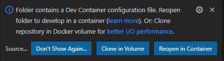
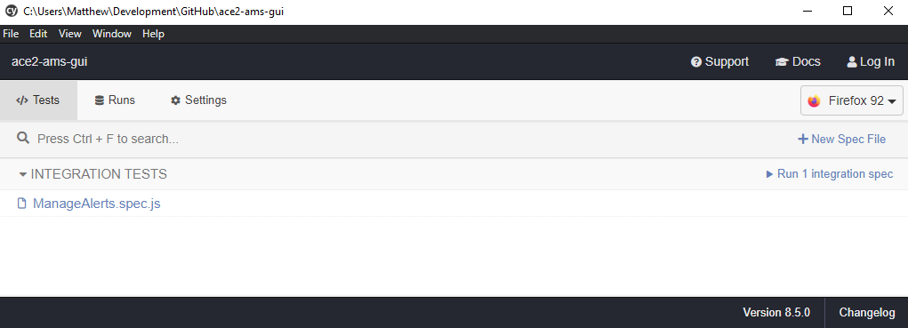

# ACE2 GUI Development Guide

## Initial setup

This project has VSCode devcontainer support to ensure that anyone working on the project does so in a consistent environment as well as follows the same formatting/styling guidelines.

### Required setup

In order to work within the devcontainer, you will need the following installed on your system:

* [Docker](https://www.docker.com/products/docker-desktop)
* [VSCode](https://code.visualstudio.com/)
* [Remote Development](https://marketplace.visualstudio.com/items?itemName=ms-vscode-remote.vscode-remote-extensionpack) VSCode extension pack

Running the frontend application inside of the devcontainer is possible but can be very slow, especially when relying on hot-reload after you make changes. In order to run the frontend application locally (outside of the devcontainer), you will also need to install:

* [Node.js 16](https://nodejs.org/en/download/current/)

> NOTE: If you are developing in Windows, you will need to make sure that you have WSL 2 set up and properly configured with Docker. That is outside the scope of this documentation, but you can find steps [here](https://docs.docker.com/desktop/windows/wsl/).

## Working in the VSCode devcontainer

When you open the project in VSCode, it will detect the devcontainer configuration and prompt you to reopen it inside of the container:



Once you choose the `Reopen in Container` option, VSCode will work on building the environment. Once it is complete, you can open a terminal within VSCode to interact with the application:


Any work done on the application should be done through the devcontainer. If you make a change to the devcontainer configuration (found in the `.devcontainer` directory), you can rebuild the devcontainer by clicking on `Dev Container: ACE2 AMS GUI` in the lower-left corner of VSCode and then selecting the `Rebuild Container` option in the menu that opens.

## Starting the application

You can start the application so that it uses hot-reloading anytime you change a file:

```
npm run serve
```

You will then be able to access the application on your local system (outside of the devcontainer) at [http://localhost:8080](http://localhost:8080).

> **NOTE:** You can run the application from within the VSCode devcontainer, but the performance will be quite slow. It is best to run it locally on your host system.

## Setting Vue environment variables

Vue needs to know the base URL to the backend API. When you run the application within the VSCode devcontainer, this is already taken care of by the Dockerfile. However, when you run the application locally on your host system for better performance, you will need to properly set the `VUE_APP_BACKEND_URL` variable.

Create a file named `.env.development.local` in the root of the project (which is ignored by Git) with the following contents:

```
VUE_APP_BACKEND_URL=http://localhost:8888/api
```

By default, the ACE2 AMS API runs on port 8888 when you start it using the instructions [as outlined](#Interaction-with-the-ACE2-AMS-API). If for some reason you have changed that port, also remember to change the port in the `.env.development.local` file.

> **NOTE:** You can create a file named `.env.production.local` with the same variable inside of it that you set to wherever you are hosting the production ACE2 AMS API. This file will be used when building the frontend for production.

## Interaction with the ACE2 AMS API

To get the full functionality out of the GUI application, it must be able to communicate with its backend API. You will want to ensure you are running the FastAPI backend, which can be found at [https://github.com/ace-ecosystem/ace2-ams-api](https://github.com/ace-ecosystem/ace2-ams-api).

Within your cloned `ace2-ams-api` repository, you can build the development environment by running:

```
bin/reset-dev-container.sh
```

This script will generate random passwords for the database user and the secret key used for JWTs. If you need to access these, you can view them in the `$HOME/.ace2.env` file, which configures the environment variables that will be loaded into the database container.

Once the both the frontend and backend development environments are built and started, you can access the components:

* Frontend: [http://localhost:8080](http://localhost:8080)
* Backend API Swagger documentation: [http://localhost:8888/docs](http://localhost:8888/docs)
* Backend API ReDoc documentation: [http://localhost:8888/redoc](http://localhost:8888/redoc)

The documentation for the `ace2-ams-api` project can be found at [https://ace-ecosystem.github.io/ace2-ams-api/](https://ace-ecosystem.github.io/ace2-ams-api/).

## Managing NPM packages

You should not directly edit the dependencies or devDependencies inside of `package.json` or anything in `package-lock.json`. **Any changes to packages should be performed via the `npm` command**:

### Install new dependency package

You would install a package like this if it is something the final compiled application needs:

```
npm install <package>
```

### Install new dev dependency package

You would install a package like this if it is only needed during development:

```
npm install -D <package>
```

### Uninstall package

You can uninstall/remove a package regardless of how it was installed by:

```
npm uninstall <package>
```

## Running tests

This application has a suite of unit tests performed by [Jest](https://jestjs.io/) and end-to-end tests performed by [Cypress](https://www.cypress.io/). 

### Unit tests
You can execute the unit tests by running:

```
npm run test:unit
```

> **NOTE:** Running the unit tests within the devcontainer will work, but the performance will be quite slow. It is best to run them locally on your host system.

### End-to-end tests
You can execute the end-to-end tests on your host system by running:

```
npm run test:e2e
```

#### Test Runner

Cypress also comes with an amazing [Test Runner](https://docs.cypress.io/guides/core-concepts/test-runner) that lets you see and interact with the tests in your local web browser. This can be helpful when writing end-to-end tests to ensure they are working properly as well as any debugging you might need to do.

However, this will need to be performed on your local system ouside of the devcontainer. To do this, you will need to have Node.js 16 [installed on your local system](#Required-setup).

**Step 1:** Run the application in production mode:

```
npm run production
```

**Step 2:** In another terminal on your local system (but still inside of the project directory), open the Test Runner:

```
npx cypress open
```



For more information on what you can do with the Test Runner, view the Test Runner [documentation](https://docs.cypress.io/guides/core-concepts/test-runner).
