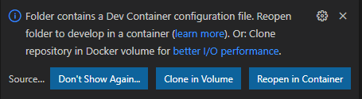

# ACE2 GUI Development Guide

## Initial setup

This project has VSCode devcontainer support to ensure that anyone working on the project does so in a consistent environment as well as follows the same formatting/styling guidelines.

### Required setup

In order to work within the devcontainer, you will need the following installed on your system:

* [Docker](https://www.docker.com/products/docker-desktop)
* [VSCode](https://code.visualstudio.com/)
* [Remote Development](https://marketplace.visualstudio.com/items?itemName=ms-vscode-remote.vscode-remote-extensionpack) VSCode extension pack

NOTE: If you are developing in Windows, you will need to make sure that you have WSL 2 set up and properly configured with Docker. That is outside the scope of this documentation, but you can find steps [here](https://docs.docker.com/desktop/windows/wsl/).

### Optional setup

The end-to-end tests with Cypress can be executed within the devcontainer, but if you would like to use the Cypress Test Runner, it must run outside of the devcontainer on your local system. You will need to install:

* [Node.js 16](https://nodejs.org/en/download/current/)

After Node.js is installed, you will need to install Cypress on your local system:

```
npm install -g cypress
```

## Working in the VSCode devcontainer

When you open the project in VSCode, it will detect the devcontainer configuration and prompt you to reopen it inside of the container:



Once you choose the `Reopen in Container` option, VSCode will work on building the environment. Once it is complete, you can open a terminal within VSCode to interact with the application:


Any work done on the application should be done through the devcontainer. If you make a change to the devcontainer configuration (found in the `.devcontainer` directory), you can rebuild the devcontainer by clicking on `Dev Container: ACE2 AMS GUI` in the lower-left corner of VSCode and then selecting the `Rebuild Container` option in the menu that opens.

## Starting the application

You can start the application inside of the devcontainer so that it uses hot-reloading anytime you change a file:

```
npm run serve
```

You will then be able to access the application on your local system (outside of the devcontainer) at [http://localhost:8080](http://localhost:8080).

## Interaction with the ACE2 AMS API

To get the full functionality out of the GUI application, it must be able to communicate with its backend API. You will want to ensure you are running the FastAPI backend, which can be found at [https://github.com/ace-ecosystem/ace2-ams-api](https://github.com/ace-ecosystem/ace2-ams-api).

Within your cloned `ace2-ams-api` repository, you can build the development environment by running:

```
bin/reset-dev-container.sh
```

This script will generate random passwords for the database user and the secret key used for JWTs. If you need to access these, you can view them in the `$HOME/.ace2.env` file, which configures the environment variables that will be loaded into the database container.

Once the both the frontend and backend development environments are built and started, you can access the components:

* Frontend: [http://localhost:8080](http://localhost:8080)
* Backend API Swagger documentation: [http://localhost:8888/docs](http://localhost:8888/docs)
* Backend API ReDoc documentation: [http://localhost:8888/redoc](http://localhost:8888/redoc)

The documentation for the `ace2-ams-api` project can be found at [https://ace-ecosystem.github.io/ace2-ams-api/](https://ace-ecosystem.github.io/ace2-ams-api/).

## Managing NPM packages

You should not directly edit the dependencies or devDependencies inside of `package.json` or anything in `package-lock.json`. **Any changes to packages should be performed inside of the devcontainer via the `npm` command**:

### Install new dependency package

You would install a package like this if it is something the final compiled application needs:

```
npm install <package>
```

### Install new dev dependency package

You would install a package like this if it is only needed during development:

```
npm install -D <package>
```

### Uninstall package

You can uninstall/remove a package regardless of how it was installed by:

```
npm uninstall <package>
```

## Running tests

This application has a suite of unit tests performed by [Jest](https://jestjs.io/) and end-to-end tests performed by [Cypress](https://www.cypress.io/).

### Unit tests
You can execute the unit tests directly inside of the devcontainer:

```
npm run test:unit
```

### End-to-end tests
You can execute the end-to-end tests directly inside of the devcontainer:

```
npm run test:e2e
```

**NOTE:** The end-to-end tests will not work inside of the devcontainer if your host system is a Mac with the M1 processor. However, you will be able to run them as outlined below in the [Test Runner](#Test-Runner) section.

#### Test Runner

Cypress also comes with an amazing [Test Runner](https://docs.cypress.io/guides/core-concepts/test-runner) that lets you see and interact with the tests in your local web browser. This can be helpful when writing end-to-end tests to ensure they are working properly as well as any debugging you might need to do.

However, this will need to be performed on your local system ouside of the devcontainer. To do this, you will need to have Node.js 16 and Cypress [installed on your local system](#Optional-setup).

**Step 1:** Inside of the devcontainer, run the application so that it is available on port 8080:

```
npm run serve
```

**Step 2:** Outside of the devcontainer on your local system (but still inside of the project directory), open the Test Runner:

```
cypress open
```


For more information on what you can do with the Test Runner, view the Test Runner [documentation](https://docs.cypress.io/guides/core-concepts/test-runner).

## WSL 2 setup

If you are using Windows and feel adventurous, you can set everything up within Ubuntu (or your distro of choice) so that you do not need to clutter your Windows installation with things like Node.js, Python, Git, etc.

To do this, you will need Docker installed and configured to work with WSL 2 as outlined in [Docker's documentation](https://docs.docker.com/desktop/windows/wsl/).

### Open the project in VSCode

Clone your `ace2-ams-gui` git repo somewhere inside of your WSL 2 instance. Then open VSCode and click on the "Remote Explorer" extension on the far left of VSCode. In the pane that opens, select "WSL Targets" from the drop-down menu at the top. Then click the "Connect to WSL" button next to the name of your WSL 2 instance. Mine is "Ubuntu". This will open a new VSCode window that is now attached to your WSL 2 instance. From there, you can open a directory like normal and have it open the `ace2-ams-gui` project. From this point, it will recognize the devcontainer setup and will prompt you to reopen the project inside of the devcontainer.

It will automatically reopen the devcontainer the next time you open VSCode, so you should not need to repeat this step.

### Install VcXsrv

On your Windows host, you will need to install an X-server so that you can run GUI applications from within your WSL 2 instance. To do that, install [VcXsrv](https://sourceforge.net/projects/vcxsrv/).

The first time you run the program, make sure you allow the firewall notification when it pops up.

To display programs that launch on the WSL side of the machine as seperate windows, choose the options "Multiple windows" and "Start no client".

On the page that lets you enable extra settings, be sure to disable access control. By default it only allows the local IP 127.0.0.1. Since WSL has its own IP address, which changes often, this will allow connections from all clients.

### Configure Git

Git should already be installed inside your WSL 2 instance (I'm using Ubuntu 20.04). Ensure it has the config that you want such as your name and email address:

```
git config --global user.name "John Doe"
git config --global user.email "johndoe@test.com"
```

### Update packages

```
sudo apt update
sudo apt upgrade
```

### Install Node.js and Cypress

```
sudo apt install nodejs npm libgtk2.0-0 libgtk-3-0 libgbm-dev libnotify-dev libgconf-2-4 libnss3 libxss1 libasound2 libxtst6 xauth xvfb
sudo npm install -g cypress
```

### Install browsers

You will likely want to install some web browsers to use with Cypress:

```
sudo apt install firefox chromium-browser
```

### .bashrc configuration

Edit your `.bashrc` or `.zshrc` file and add the following to the end:

```
# set DISPLAY variable to the IP automatically assigned to WSL 2
export DISPLAY=$(cat /etc/resolv.conf | grep nameserver | awk '{print $2; exit;}'):0.0

sudo /etc/init.d/dbus start &> /dev/null
```

### Sudoers configuration

Your user within WSL 2 needs to be able to run the `dbus` service that was added in your `.bashrc` file without being prompted for a password. To do that, edit the sudoers configuration:

```
sudo visudo -f /etc/sudoers.d/dbus
```

Within the `nano` window that opens, add the following (replacing `username` with whatever your username is inside of WSL):

```
username ALL = (root) NOPASSWD: /etc/init.d/dbus
```

### Reload your shell

The changes made to your `.bashrc` file need to be sourced so that they take effect. Either close and reopen your WSL 2 window or run:

```
source ~/.bashrc
```

### Verify

At this point, you should be able to open Cypress within WSL 2 and have the GUI open. Make sure you are inside of the cloned `ace2-ams-gui` repo directory before running:

```
npx cypress open
```

If you see an error saying "Cypress could not verify that this server is running", it means you have not started the Vue.js application. You can do so either from a second WSL 2 window or inside of VSCode in the devcontainer by running:

```
npm run serve
```