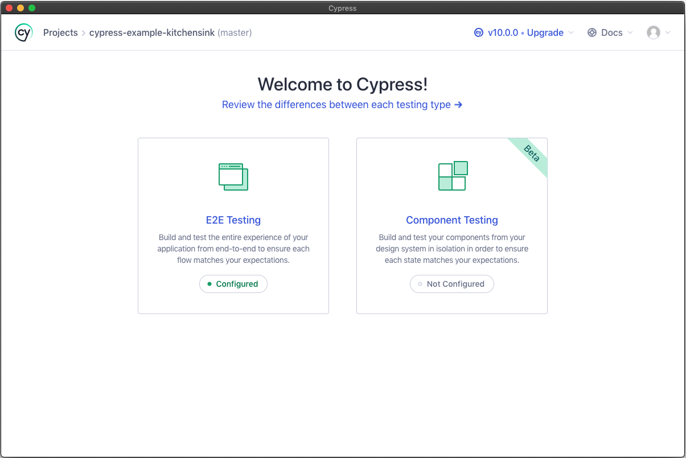

# Setup

## Initial setup

This project requires the use of Docker, Python (3.9.x), and Node.js (16.x). Install those as normal for your operating system. However, if you are on Windows, see the Windows section below.

### Windows

If you want to run the Cypress component or end-to-end tests using the graphical test runner (instead of just from the command line), you will need to either:

- Ensure you have Node.js 16.x installed within Windows.

OR

- If you are using WSL2 (see below), install an X-server in Windows so that when you run `npx cypress open` within WSL2 it is able to connect to the X-server to display the Cypress GUI. To do this, you can follow the instructions as described in [this Stack Overflow answer](https://stackoverflow.com/a/61110604).

#### Using WSL2 (Optional)

If you have access to WSL2, a better development experience (to not have to deal with Docker Desktop's performance issues) in Windows is to set up WSL2 with Ubuntu.

Then within Ubuntu, you would install Docker, Python, and Node.js and do all of your work from there.

VSCode can also be configured using the `Remote - WSL` extension to connect to a folder within your WSL2 instance.

## Updating your hosts file

Until we figure out a better way to deal with this, your local system will need an entry in the hosts file to properly work with the AMS development environment. This is because of the combination of how the Docker containers interact with one another, CORS, and the fact that the dev environment does not use HTTPS, which carries implications for the HttpOnly cookies that are used with the frontend's authentication.

For Mac/Linux, this file is located at `/etc/hosts`.

In Windows, this file is located at `C:\Windows\System32\drivers\etc\hosts`. You will need to open Notepad or another text editor as an Administrator in order to edit the hosts file.

Add the following entry to the file:

```
127.0.0.1 ace2-ams
```

## Starting the application

You can start the application using Docker containers so that it uses hot-reloading anytime you change a file:

```
bin/reset-dev-container.sh
```

This script will generate random passwords for the database user and the secret key used for JWTs. If you need to access these, you can view them in the `$HOME/.ace2.env` file, which configures the environment variables that will be loaded into the database container.

Once the both the frontend and API development environments are built and started, you can access the components:

- Frontend: [http://ace2-ams:8080](http://ace2-ams:8080)
- Database API Swagger documentation: [http://ace2-ams:8888/docs](http://ace2-ams:8888/docs)
- Database API ReDoc documentation: [http://ace2-ams:8888/redoc](http://ace2-ams:8888/redoc)
- GUI API Swagger documentation: [http://ace2-ams:7777/docs](http://ace2-ams:7777/docs)
- GUI API ReDoc documentation: [http://ace2-ams:7777/redoc](http://ace2-ams:7777/redoc)

## Managing NPM packages

You should not directly edit the dependencies or devDependencies inside of `package.json` or anything in `package-lock.json`. **Any changes to packages should be performed via the `npm` command**:

### Install new dependency package

You would install a package like this if it is something the final compiled application needs:

```
npm install <package>
```

### Install new dev dependency package

You would install a package like this if it is only needed during development:

```
npm install -D <package>
```

### Uninstall package

You can uninstall/remove a package regardless of how it was installed by:

```
npm uninstall <package>
```

## Running tests

### Database API

The database API has a suite of tests performed by Pytest that includes code coverage:

```
bin/test-db-api.sh
```

You can run a specific portion of the tests using the same script:

```
bin/test-db-api.sh db_api/app/tests/api/test_auth.py
```

### GUI API

The GUI API has a suite of tests performed by Pytest that includes code coverage:

```
bin/test-gui-api.sh
```

You can run a specific portion of the tests using the same script:

```
bin/test-gui-api.sh gui_api/app/tests/api/test_auth.py
```

### Frontend

This frontend has a suite of unit tests performed by [Vitest](https://vitest.dev/) and component and end-to-end tests performed by [Cypress](https://www.cypress.io/).

#### Unit tests

You can execute the unit tests by running:

```
bin/test-frontend-unit.sh
```

#### Component Tests

You can execute the end-to-end tests by running:

```
bin/test-components.sh
```

#### End-to-end tests

You can execute the end-to-end tests by running:

```
bin/test-e2e.sh
```

##### Test Runner

Cypress also comes with an amazing [Test Runner](https://docs.cypress.io/guides/core-concepts/test-runner) that lets you see and interact with the tests in your local web browser. This can be helpful when writing component and end-to-end tests to ensure they are working properly as well as any debugging you might need to do.

However, this will need to be performed on your local system ouside of the containers (see the [Windows](./index.md#windows) setup section in case you are using WSL2). To do this, you will need to have [Node.js 16](https://nodejs.org/en/download/current/) installed.

**Step 1:** Prep the application to run the tests in interactive mode (this tells the containers to use the test database):

```
bin/test-interactive-e2e.sh
```

**Step 2:** Install the Node.js packages on your host system (this only needs to be done one time or when `package.json` is updated):

```
cd frontend/
npm install
```

**Step 3:** Open the Test Runner on your host system:

```
cd frontend/
npx cypress open
```



For more information on what you can do with the Test Runner, view the Test Runner [documentation](https://docs.cypress.io/guides/core-concepts/test-runner).

**Step 4:** Disable testing mode once you are finished using the Test Runner:

```
bin/disable-test-mode.sh
```
